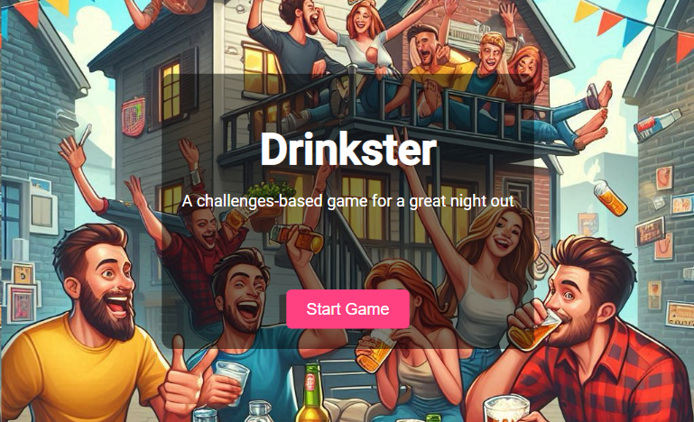

# Drinkster

Drinkster is a drinking game application that provides fun and engaging challenges for users to enjoy with friends.
Be it a party, a night out, or a casual gathering, Drinkster is the perfect companion to spice up the night. [^1]


## Features

- 🎲 Randomized drinking challenges to keep the fun unpredictable.
- ⚙️ Customizable game settings for tailored experiences.
- 📝 User-submitted challenges (hidden) for personalized twists.
- 🐳 Easy deployment with a single Docker Compose setup.

## Installation

1. Clone the repository:
    ```bash
    git clone https://github.com/josemartins/Drinkster.git
    ```
2. Navigate to the project directory:
    ```bash
    cd Drinkster
    ```
3. Build and deploy:
    ```bash
    docker compose build
    ```

## Usage


1. Navigate to the project directory:
    ```bash
    cd Drinkster
    ```
2. Change the path volumes in the `docker-compose.yml` file to the path to your certificates.

3. Start the server:
    ```bash
    docker compose up 
    ```
    or (to run in the background)
    ```bash
    docker compose up -d
    ```
4. Change the port in the `docker-compose.yml` file to the port you want to use.

5. Open your browser and navigate to `https://localhost:<your-port>`

### Customization
 * Change Port
    - To change the port, edit the `docker-compose.yml` file and change the `ports` configuration for the `web` service.
    - For example, to change the port to `8080`, change the configuration to `8080:443`.

### Add Challenges

1. Create a JSON file with the challenges you want to add in the format:
    ```json
    [
        {
            "challenge": "Challenge",
            "difficulty": 1,
            "sexes": []
        }
    ]
    ```
    
    * Notes: 
    - If you want the challenge to use the player name, use `{Player}` in the challenge body for the main Player and `{Player2}` for a second player. 
        - Check sexes note for info on how to write player sexes.

    - The `difficulty` field is a number 1-4, where 1 is the easiest and 4 is the hardest.
        - 1: Easy, 2: Medium, 3: Hard, 4: Extreme

    - The `sexes` field is an array of strings and only allows `M`,`F` and `All`.
        - The `sexes` field is only used if the challenge body contains `{Player}`.
        - Example: `["M","F"]` will only allow a challenge to be used when the first player is male and the second player is female.

2. Do a POST request to `https://localhost:<ypur-port>/api/challenge/add-all` with the JSON file as the request body.
    - You can use a tool like [Postman](https://www.postman.com/) to make the request.
 
OR

1. Go to https://localhost:<your-port>/add.
    - This only allows to add a challenge at a time.

## License

This project is licensed under the MIT License. See the [LICENSE](LICENSE) file for details.


[^1]: **Disclaimer**: Drinkster is intended for users of legal drinking age. Please drink responsibly.
