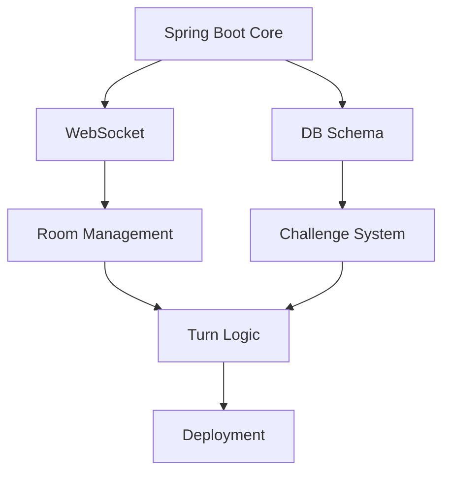

# Drinkster Backend SCRUM Plan

## Core Flow
1. Player Matchmaking → Game Room → Challenge Distribution → Turn Execution → Penalty Application → Session Persistence

## Phase 1: Infrastructure Foundation (22 pts)
| Story                | Task Breakdown                                                                                                             | Points | Hours | Priority |
|----------------------|----------------------------------------------------------------------------------------------------------------------------|--------|-------|----------|
| 1.1 Spring Boot Core | • Initialize project (Web/Data JPA/WebSocket) • PostgreSQL containerization • Health endpoints (/health, /metrics)   | 5      | 6     | Critical |
| 1.2 Domain Modeling  | • Challenge Entity (content, difficulty) • GameSession (relationships)                                                  | 4      | 5     | High     |
| 1.3 WebSocket Layer  | • STOMP broker configuration • Session authentication • Heartbeat mechanism (30s) • Error payload standardization | 7      | 8     | Critical |
| 1.4 Data Pipeline    | • Flyway migration scripts • Test data seeding • H2 test profile setup                                               | 3      | 4     | Medium   |

## Phase 2: Game Engine (32 pts)
| Story                | Task Breakdown                                                                                               | Points | Hours | Priority |
|----------------------|--------------------------------------------------------------------------------------------------------------|--------|-------|----------|
| 2.1 Room Management  | • Room state machine (3 states) • Redis session storage • Player capacity rules • Auto-cleanup cron | 8      | 10    | Critical |
| 2.2 Challenge System | • Weighted random selection • Category-based filtering • Cooldown mechanism • NSFW content flagging | 9      | 12    | Critical |
| 2.3 Turn Logic       | • Turn order algorithm • Timeout handling • Interrupt management • State synchronization            | 7      | 9     | High     |
| 2.4 Penalty System   | • Drink counter service • Penalty escalation rules • Visual effect triggers                            | 5      | 6     | High     |

## Phase 3: Security & Scaling (20 pts)
| Story            | Task Breakdown                                                                           | Points | Hours | Priority |
|------------------|------------------------------------------------------------------------------------------|--------|-------|----------|
| 3.1 Auth Flow    | • JWT claim customization • WebSocket handshake validation • Token revocation list | 6      | 7     | High     |
| 3.2 Rate Control | • Bucket4j integration • Per-endpoint limits • Ban escalation policy               | 5      | 6     | Medium   |
| 3.3 Admin API    | • Challenge moderation endpoints • User ban hammer • Analytics exposure            | 4      | 5     | Medium   |

## Phase 4: AI Integration (18 pts)
| Story              | Task Breakdown                                                              | Points | Hours | Priority |
|--------------------|-----------------------------------------------------------------------------|--------|-------|----------|
| 4.1 GPT-4 Pipeline | • Prompt template engine • Response validation • Cost monitoring      | 7      | 9     | High     |
| 4.2 Moderation     | • OpenAI moderation API • Local keyword filter • Challenge quarantine | 5      | 6     | Critical |
| 4.3 Feedback Loop  | • Player voting system • Challenge retirement rules • Quality metrics | 4      | 5     | Medium   |

## Phase 5: Deployment (18 pts)
| Story                | Task Breakdown                                                                 | Points | Hours | Priority |
|----------------------|--------------------------------------------------------------------------------|--------|-------|----------|
| 5.1 Containerization | • Multi-stage Dockerfile • Helm charts • Graceful shutdown               | 6      | 7     | High     |
| 5.2 Observability    | • Prometheus metrics • Grafana dashboard • AlertManager rules            | 5      | 6     | Medium   |
| 5.3 Load Testing     | • WebSocket stress test • DB failover simulation • Rate limit validation | 4      | 5     | High     |

## SCRUM Analysis

### Team Roles
- **Backend Lead**: Game logic + WebSocket
- **DevOps**: Infrastructure + Deployment
- **Security**: Auth + Rate limiting
- **AI Engineer**: GPT integration

### Sprint Planning (2-week cycles)
| Sprint | Focus Area           | Key Deliverables     | Risks                 |
|--------|----------------------|----------------------|-----------------------|
| 1      | Core Foundation      | Playable MVP (no AI) | WebSocket latency     |
| 2      | Game Mechanics       | Full round lifecycle | State sync complexity |
| 3      | Safety Layer         | Moderation system    | False positives       |
| 4      | Production Readiness | HA deployment        | Resource constraints  |

### Velocity Tracking
- **Story Points**: 100 total (~20/sprint)
- **Capacity**: 5 devs × 35 hrs/week = 175 hrs/sprint
- **Buffer**: 15% contingency (26 hrs/sprint)

### Critical Path
1. WebSocket reliability → Game state integrity
2. Challenge distribution → Player retention
3. Moderation system → Legal compliance
4. Container orchestration → Uptime SLAs

### Dependency Graph
